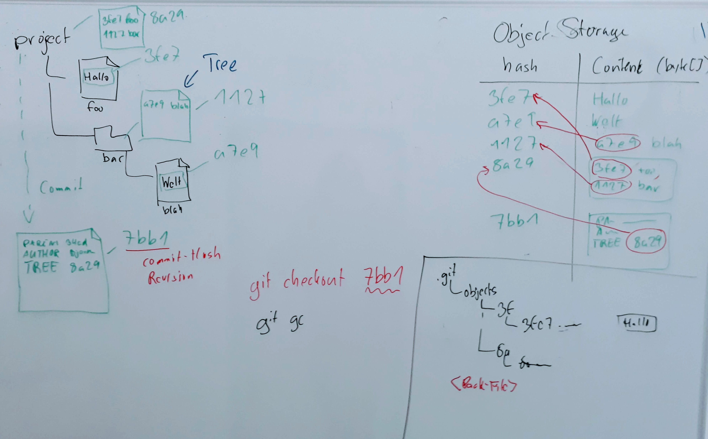

# Commits

---

### Lernziel

Wie *erstelle* ich Commits?

Was genau *ist* eigentlich ein Commit?

Wie *markiere* ich Commits mit *Tags*?

**Oops!** Was tun, wenn mal was schief geht?

---

### Lernziel (Befehle)

```bash
    # Commits erstellen
    git status
    git diff
    git commit

    # Änderungen hinzufügen (Staging,Index)
    git add
    git commit -a

    # Commits mit Tags markieren
    git tag

    # Oops!
    git stash
    git revert
```

---

### Begriff: `HEAD`

`HEAD` bezeichnet die vorige Version.

(von vorigem `commit`, oder `checkout`)

```bash
git show HEAD
```

---


### `git status`

zeigt, was im Workspace los ist:

  * Welches ist der *aktive Branch*?
  * Wurden Dateien (bezogen auf `HEAD`)
    - gelöscht?
    - bearbeitet?
    - neu angelegt?
  * Außerdem: Mergekonflikte, Synchr.-Status

Notes:

 * Verzeichnisse werden zusammengefasst
 * Außerdem Änderungen bezogen auf HEAD oder Index

---

### Tipp

Vor wichtigen Operationen,

immer checken, ob der Status *clean* ist:

```bash
    $ git status
      ...
    nothing to commit, working tree clean
```

Notes:

 * Hinweise auf stash
 * TODO Hinweis auf Prompts

---

### `git diff`

vergleicht Commits, den Workspace, den Index, Verzeichnisse und Dateien.

 * **ohne Parameter:** HEAD -> Workspace
   ```bash
   git diff
   ```

 * **1 Parameter:** Workspace -> Commit
   ```bash
   git diff HEAD~2
   ```


Notes:

 * Was Index/Stage ist, kommt später
 * Diff-Format kurz zeigen und beschreiben

---

### `git diff`

 * **2 Parameter:** Commit -> Commit
   ```bash
   git diff HEAD~5 HEAD~2
   ```

 * **Auf Datei/Verzeichnis einschränken:**
   ```bash
   git diff HEAD~2 -- src/main/java/
   ```

Notes:

 * Reihenfolge ist relevant. +/- vertauscht sich
 * `difftool` zeigen
 * `--` kann weggelassen werden, wenn es keine Namenskonflikte zwischen Datein und Commits gibt.


---

### Aktiver Branch

 * Ein Branch ist ein Zeiger auf ein Commit
 * (max.) 1 Branch ist aktiv
 * Default `master`
 * Neues Commit: Zeiger des aktiven Branches wird aktualisiert.


---

### Commit - geänderte Dateien

Einzelne Datei:

    git commit <file>

Alle geänderen Dateien, die bereits versioniert sind.

    git commit -a

Und gleich mit Message:

    git commit -am "Edit some files."


---

### Commit - neue Dateien

Neue Dateien werden beim `commit -a` nicht automatisch übernommen. Sie müssen zunächst angemeldet werden.

    git add <file>

    git add <dir>

    git add .

Dann Commit, wie gehabt.

    git commit


---

### Commit - gelöschte Dateien

    rm my-file # Oder über file explorer

Löschungen werden bei `-a` übernommen:

    git commit -am 'deleted my-file'

Es gibt auch einen Git-Befehl zum Löschen:

    git rm my-file
    git commit -am 'deleted my-file'


---

## Umbenennen und verschieben

   - `mv`
   - `log --follow`, `-M`
   - Tipp: Separate move from Change
     1. Move
     1. Commit
     1. Change
     1. Commit


---

Was genau ist in einem Commit enthalten?

    git log --pretty=raw


---

Commit Trees




---


## Verzeichnisse

Verzeichnisse werden in Git nicht explizit versioniert.

Ein Verzeichnis muss mindestens eine Datei enthalten.

Ggf. legt man ein hidden File an, z. B. `.gitkeep`


---

## Tags

    git tag v0.1.7


---

### Oops - Unterbrechung!

Angefangene Änderungen kann man jeder zeit mit `stash` wegsichern.

    git stash
    git stash -u
    git stash --all
    git stash -m "bugfix started"
    git stash pop


---

### Oops - fehlerhaftes Commit


    revert  HEAD~3


---

### Oops - versehentlich geändert

Vorsicht: Dateien werden überschrieben!

Datei versehentlich geändert

    git checkout HEAD -- foo

Alte Version einer Datei wieder herstellen

    git checkout HEAD~3 -- foo

Ganzen Workspace zurücksetzen

    git stash -u


### Übung 02: Commits erstellen

Starten sie im *Übungsverzeichnis* (wo sie das Zip-Archiv mit den
Übungen entpackt haben).
Öffnen sie die Anleitung im *Browser* (mit dem Kommando `start` auf
Windows, `xdg-open` auf Ubuntu,`open` auf MacOs).
**Achtung!** Es ist wichtig, die Übungen im *angegebenen
Startverzeichnis* zu beginnen. Achten Sie auf die Beschreibung:

    $ cd git-uebungen-<Zeitstempel z. B. 202005252000>
    $ start aufgaben/02-commits-erstellen/index.html 
    $ cd aufgaben/<angegebenes Startverzeichnis>

Folgen Sie dann den weiteren Anweisungen.
